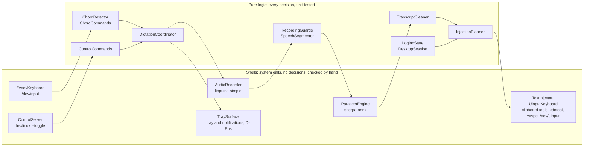

# HexLinux

Local voice dictation for Linux. Hold **right `Ctrl`**, speak, release — the
text lands at your cursor.

Everything runs **on your machine**. No cloud service, no subscription, no
network connection needed once the model is downloaded.

## HexWin, for Linux

[HexWin](https://github.com/legb78/hex_windows) is a hold-to-talk dictation app
for Windows, itself the Windows answer to [Hex](https://github.com/kitlangton/Hex)
on macOS. HexLinux is its Linux sibling: same engine, same architecture, same
rules, same diagnostic modes, written for the platform — C# on .NET 10, the
kernel's input devices, PulseAudio or PipeWire, and the clipboard and keystroke
tools of X11 and Wayland desktops.

The engine is **Parakeet TDT v3** by NVIDIA, run locally by sherpa-onnx. It
identifies the spoken language on its own among 25 European languages, so the
language you dictate in is not a setting. HexWin chose it over Whisper after
measuring both; its README explains why.

## How fast it is

Measured under WSL2 on a Core Ultra 7 255H — the processor of HexWin's own
figures — on CPU, with 4 threads:

| Speech length | Wait after release | HexWin, same processor, Windows |
|---------------|--------------------|---------------------------------|
| 5 s | 0.215 s | 0.19 s |
| 40 s | 1.616 s | 1.58 s |

Loading the model took 2.7 s. It then holds about 0.8 GB of memory, 1.1 GB
after a few dictations — which is why it is released after five idle minutes
(`unloadAfterMinutes`). Figures on a native Linux install are still to be
recorded.

## Install

### From a release

Download `hexlinux-linux-x64.tar.gz` and `SHA256SUMS` from the
[latest release](https://github.com/legb78/hex_linux/releases/latest), then:

```sh
sha256sum -c SHA256SUMS         # the archive is the one published
tar -xzf hexlinux-linux-x64.tar.gz
cd hexlinux
./get-model.sh                  # about 490 MB, once; checked before it is extracted
./hexlinux --doctor             # what HexLinux can see of your session
./hexlinux
```

Nothing to install for HexLinux itself — not even .NET, which is bundled inside
the executable. What it drives comes from your distribution: on Debian or
Ubuntu,

```sh
sudo apt install ca-certificates curl bzip2 libpulse0 pulseaudio-utils wl-clipboard xclip xdotool wtype libnotify-bin xdg-utils
```

and the equivalent packages elsewhere: `curl` and `bzip2` for `get-model.sh`,
libpulse for the microphone and the tones, `pactl` to check which microphone is
the default, the clipboard and keystroke tools of your session, `notify-send`
and `xdg-open`. `--doctor` names the ones your session is missing; you only
need those.

`get-model.sh` puts the model in `~/.local/share/hexlinux/models`, and checks
the size and SHA-256 of the archive against values pinned in the script
before extracting anything. If the model's publisher ever replaces the file,
the script refuses it until it is updated. It fetches the speech detector that
finds the pauses, `silero_vad.onnx`, under the same checks; HexLinux checks
that file again before loading it, since a damaged one would crash the native
library.

To start HexLinux with your session:

```sh
./hexlinux --autostart on       # --autostart off removes it
```

The entry points at the executable where it stands. Move the folder and run
`--autostart on` again from the new place — or just start HexLinux from there
once: an entry whose executable is gone is pointed at the running one, while an
entry that still starts a working copy is left alone. Autostart is refused for
a build made with `dotnet build` (it needs the .NET SDK's runtime, which a login
session does not find: use the release or `scripts/publish.sh`), for a folder
whose path holds a `%` (GNOME cannot start it), and for a binary another user
could replace. Sway and Hyprland do not read
`~/.config/autostart`: start it from their configuration instead
(`exec /path/to/hexlinux` for Sway, `exec-once = /path/to/hexlinux` for
Hyprland).

GitHub keeps its own digest of every release file, if you would rather not
trust the checksum file published next to it:

```sh
gh release view vX.Y.Z --repo legb78/hex_linux --json assets --jq '.assets[] | .name + " " + .digest'
```

### If you compile it yourself

You need the **.NET 10 SDK**. On Debian or Ubuntu, `scripts/setup-dev.sh`
installs it in `~/.dotnet` along with the tools above.

```sh
scripts/setup-dev.sh
scripts/get-model.sh
dotnet build -c Release
./src/HexLinux/bin/Release/net10.0/hexlinux
```

The scripts the release carries at its root are under `scripts/` in a clone:
`sudo scripts/install-udev-rules.sh` below, for instance. For
`--autostart on`, use what `scripts/publish.sh` builds: the output of
`dotnet build` only runs where `DOTNET_ROOT` points at the SDK.

## Using it

There are two ways to dictate, and the difference is a permission.

### Holding a key: the keyboard permission

Seeing a key held down, whichever window has the focus, means reading the
keyboards under `/dev/input`, which an ordinary user cannot do. The installer
grants it through udev:

```sh
sudo ./install-udev-rules.sh               # keyboards: hold right Ctrl
sudo ./install-udev-rules.sh --with-uinput # also the virtual keyboard, see below
# then log out and back in
sudo ./install-udev-rules.sh --uninstall   # removes everything it installed
```

**Know what this grants.** The rule gives the user of the active session read
and write access to the keyboards — and that means **every program you run**,
not only HexLinux. Any of them can then read everything you type, passwords
included, and inject keystrokes. The virtual keyboard rule goes further: it lets
any of your programs type anywhere, the lock screen and a root terminal
included. That is the price of hold-to-talk on Linux. The other usual way, the
`input` group, is broader still — every input device, in every session, even
another user's — and HexLinux never adds anyone to it.
[SECURITY.md](SECURITY.md) spells it out. The installer runs as root: check
the archive with `sha256sum -c SHA256SUMS` before you run it.

HexLinux itself only observes the keys: it never grabs a keyboard, so every key
still reaches your desktop. Every key of the keyboards it listens to is
compared, in memory, with the shortcut — another key cancels a dictation being
held, and held modifiers are tracked so that the paste can wait for them to be
let go. None is stored or logged.

### Pressing a shortcut: no permission at all

Bind `hexlinux --toggle` to a shortcut of your desktop — press it to start,
press it again to stop. The desktop handles the key, and HexLinux reads no
keyboard.

- **GNOME**: Settings > Keyboard > Keyboard Shortcuts, a custom shortcut
  running the full path of `hexlinux` with `--toggle`.
- **KDE Plasma**: System Settings > Shortcuts, a new command.
- **Sway**, in `~/.config/sway/config`:
  `bindsym $mod+d exec /path/to/hexlinux --toggle`
- **Hyprland**: `bind = SUPER, D, exec, /path/to/hexlinux --toggle`

`--start`, `--stop` and `--cancel` exist too, and `--status` says what the
daemon is doing. Sway can also run a command when a key is *released*
(`bindsym --release`): `--start` on the press and `--stop` on the release
would give hold-to-talk without any permission — not yet confirmed with a
modifier key alone. Under GNOME and KDE on Wayland, pasting the text still needs
the virtual keyboard (below); without it, `"clipboardFallback": true` leaves
the text in the clipboard with a notification asking you to press `Ctrl`+`V`.
Together, the shortcut and the fallback are the way to use HexLinux with no
permission at all.

### How the text gets in

Wayland lets no ordinary program type into another's window, and each desktop
offers a different way around that, or none. HexLinux picks what the session
allows (`--doctor` shows its choice):

| Session | Paste mode | Type mode |
|---------|------------|-----------|
| X11 (GNOME on Xorg, Xfce, Cinnamon, MATE, KDE on X11) | xdotool | xdotool |
| GNOME or KDE Plasma on Wayland | the virtual keyboard, with its rule | not possible |
| wlroots compositors (Sway, Hyprland…) | the virtual keyboard, or wtype | wtype |

**Paste** (the default) puts the text in the clipboard, sends the paste
shortcut, then restores what the clipboard held. **Type** simulates typing,
character by character, and leaves the clipboard alone.

### What you see and hear

A short tone marks the start of a recording, a lower one its end. On desktops
that show tray icons — KDE Plasma, Xfce, Cinnamon, Budgie, wlroots bars, and
GNOME with the AppIndicator extension, which Ubuntu ships enabled — an icon
shows the state:

| Colour | State |
|--------|-------|
| Grey | Loading the model |
| Blue | Ready |
| Red | Recording |
| Orange | Transcribing |
| Crossed grey | Model unusable: it could not be loaded |

Its menu dictates, opens the settings file and the log folder, switches the
tones and the start at login, and quits. Failures that need you — model
missing, microphone missing, text that could not be inserted, a locked
screen — arrive as desktop notifications. Where there is no tray, HexLinux
runs all the same.

A model missing altogether stops HexLinux at start, with exit code 2 and a
notification naming `get-model.sh`, before any icon appears.

For long dictations, turn on `segmentation`: each pause in your speech then
closes a piece, transcribed and inserted while you keep talking, instead of
everything arriving at release. A dictation cancelled halfway — another key
pressed while the shortcut is held — keeps the pieces already inserted. Once
the shortcut is released, its keys go back to their ordinary uses: a Right
`Ctrl`+`C` typed while the dictation is transcribed copies, and cancels
nothing. The shortcut never ends or cancels a dictation started from
`--toggle` or the tray either; `hexlinux --cancel` does, at any point. A
sentence cut in two by a pause is stitched back, without a stray full stop.

Hesitations — *euh*, *hum*, *uh*, *um* — are dropped. Saying *efface ça*,
*supprime la dernière phrase*, *scratch that* or *delete the last sentence* on
its own erases the sentence before it; with `segmentation` on, a sentence
already inserted is erased with Backspace, once no `Ctrl`, `Alt`, `Shift` or
`Super` key is held. Only text the same dictation inserted is ever erased.

## Settings

`~/.config/hexlinux/settings.json` (or under `$XDG_CONFIG_HOME`). On the first
start, the commented default file — the `settings.json` shipped next to the
executable, also built into it so that the executable alone is enough — is
copied there, comments included; an existing file is never overwritten. Comments are
allowed, and **an invalid value falls back to its own default** — the other
settings of the file are kept — rather than preventing startup.

| Setting | What it does |
|---------|--------------|
| `hotkey` | Keys to hold. Default `["RightCtrl"]`. Names: `Ctrl`, `LeftCtrl`, `RightCtrl`, `Alt`, `LeftAlt`, `RightAlt`, `Shift`, `LeftShift`, `RightShift`, `Super`, `LeftSuper`, `RightSuper` (HexWin's `Win` names are accepted), `F1` to `F24`, `Pause`. HexWin accepts any key; here the keys that type, edit, move the cursor, toggle a state or that the desktop acts on (letters, `Space`, arrows, numpad, `CapsLock`, `Insert`, media keys) are refused, because the keys are not withheld from the desktop — `--doctor` says why. `F1`–`F12` still reach the application. `Fn` emits nothing Linux can see. `--watch-hotkey` names the keys you press. |
| `insertion` | `Paste` (clipboard, instant) or `Type` (simulated keystrokes, where the session allows it). |
| `pasteShortcut` | The keystroke that pastes: `CtrlV` (default), `CtrlShiftV` for terminals, or `ShiftInsert`. In xterm and terminals of its family, `ShiftInsert` pastes the primary selection — your last selected text — not the dictation. |
| `keySender` | Who sends the keys: `Auto` (default), `Uinput`, `Xdotool` or `Wtype`. |
| `clipboardFallback` | `false` by default. `true`: when no way to send keys is available, the text is left in the clipboard and a notification asks you to paste it. A clipboard history keeps it, which is why it is off by default. |
| `feedback` | `Sound` (default): a tone at each end of the recording. `None`: silence. |
| `frenchSpacing` | `true` by default, as in HexWin: the French space before `?`, `!`, `;` and `:`, in text that reads as French — judged by its small words and accents, since the engine does not say which language it heard; a sentence with no clue counts as French. `false` never adds it. |
| `modelPath` | Folder of the Parakeet model. A relative path is looked for in `~/.local/share/hexlinux` first, then next to the executable. |
| `provider` | `cpu`, the only one available: the published native libraries are built for the processor only. |
| `threads` | Threads given to decoding. `0`, the default, picks one per physical core, up to 8; `1` to `32` is used as written. |
| `minRecordingMilliseconds` | Below this, the press is treated as accidental. Default 250. |
| `maxRecordingSeconds` | Stops recording if the key stays held, 5 to 600. Default 120. |
| `segmentation` | `true` inserts a long dictation piece by piece, while you keep talking. `false` (default) inserts everything at release. |
| `pauseMilliseconds` | With `segmentation` on, a pause this long closes a piece. Default 700, up to 5000. Found by Silero VAD, a voice detector that `get-model.sh` installs next to the model (630 KB), so a fan or a street is not taken for speech. Without that file, found on the sound level: in a noisy room no pause is seen and the text simply arrives at release. |
| `unloadAfterMinutes` | Frees the model — about 1 GB of memory — after this long without dictating. `0` keeps it loaded. Default 5. Reloading starts when you *press* the hotkey, so it overlaps with you speaking. |
| `logEnabled` | `true` (default) logs every dictation — duration, captured level, characters produced. Never the text. |

Where the rest lives:

| What | Where |
|------|-------|
| Model | `~/.local/share/hexlinux/models/` (`$XDG_DATA_HOME`) |
| Log, and `crash.log` after a crash | `~/.local/state/hexlinux/hexlinux.log` (`$XDG_STATE_HOME`) |
| Control socket | `$XDG_RUNTIME_DIR/hexlinux/control.sock` |
| Start at login | `~/.config/autostart/hexlinux.desktop` |

## When something goes wrong

Start with `--doctor`: it reports the session type, the settings file and any
value it rejected, the model, the keyboards found and whether they can be read,
the virtual keyboard, the tools, the microphone, the insertion plans for both
modes and the screen lock state — and exits with an error when something
essential is missing.

Then the diagnostic modes, one per layer, in this order: each isolates one
layer, which is how you find out where the fault actually is instead of
guessing.

```sh
./hexlinux --doctor

# 1. Is the microphone picking anything up?
./hexlinux --record test.wav            # --seconds 5 by default

# 2. Does the engine transcribe that file? (16 kHz mono 16-bit WAV, as --record
#    writes; any other format is named and refused)
./hexlinux --transcribe test.wav

# 3. Does the hotkey fire?
./hexlinux --watch-hotkey

# 4. Does insertion reach the window? Click into a text field during the delay.
./hexlinux --inject "some text"         # --mode Type, --sender uinput|xdotool|wtype, --delay 4

# 5. Do the start and end tones play?
./hexlinux --test-feedback
```

A text given to `--inject` on the command line is visible to every user of
the machine while it runs; `--inject -` reads it from standard input instead.
Test with text that is not a secret either way.

`hexlinux --status` asks the running daemon what it is doing, and prints the
state: `loading`, `idle`, `recording`, `transcribing` or `failed`. The other
control commands print the state they led to, `ignored (<state>)` when they
mean nothing in that state (a `--start` during a transcription), or
`error: <word>` — `error: busy` when the daemon could not act within a few
seconds. `HexLinux is not running.` (exit code 1) means that nothing listens;
a daemon that is there but does not answer in time gets its own message and
exit code 3. On the socket itself, the daemon answers one line: `ok <state>`,
`ignored <state>` or `error <word>`.

Start with the first. A muted microphone produces a perfectly valid file of the
right duration that is completely silent — and the engine may then invent a
sentence from it. `--record` measures the level and says so; without that
reading you would go looking for the fault in the transcription, which is the
wrong end entirely.

The log records, for every dictation, the duration, **the captured level** and
the number of characters produced. Those three numbers together tell you
whether the microphone heard you, whether the engine understood you, and
whether the text made it out.

| Exit code | Meaning |
|-----------|---------|
| 0 | Success |
| 1 | Generic failure: bad arguments, daemon not running or already running, recording too short, a file `--transcribe` cannot take |
| 2 | The model is missing or incomplete (run `get-model.sh`) |
| 3 | Failure: microphone, tones, transcription or insertion impossible, or a running daemon that did not answer |
| 4 | The recording was silent |
| 5 | No keyboard can be read: the shortcut is unavailable (see `--doctor`) |

### Known limits

- **The keys of the shortcut still reach the desktop.** Linux has no way to
  withhold a key short of grabbing the whole keyboard, which would put HexLinux
  on the path of everything you type. The default, right `Ctrl` alone, does
  nothing on its own; `Space` and `CapsLock` are refused for that reason.
- **GNOME and KDE on Wayland** accept keys from no ordinary program: pasting
  needs the virtual keyboard rule, and Type mode is not possible there. wtype
  works on wlroots compositors only — not on GNOME, KDE or WSLg.
- **Keyboard layouts**: the virtual keyboard sends key *positions*. On layouts
  where V is not where QWERTY has it (Dvorak, Bépo), `Ctrl`+`V` becomes another
  shortcut; set `pasteShortcut` to `ShiftInsert`. QWERTY, AZERTY and QWERTZ are
  not affected. xdotool, used under X11, does not depend on the layout.
- **Clipboard history**: in Paste mode, clipboard managers (Klipper, GNOME
  extensions, cliphist, CopyQ) record the dictation. HexLinux cannot keep it
  out of them, unlike HexWin on Windows. Klipper, on by default in KDE Plasma,
  also keeps its history from one session to the next and refuses an empty
  clipboard, which undoes the clearing HexLinux does when it had nothing to
  restore. Type mode leaves the clipboard alone.
- **One clipboard format comes back**: the tools restore a single format, so
  a copy offered in several comes back in one of them — plain text first,
  then an image, then a file list; rich text returns as plain text. A password
  copied from a password manager that marks it as a secret (KeePassXC) is
  cleared after the paste rather than restored, so that no history records it
  without its mark.
- **The text goes to the window focused at insertion time.** HexWin brought
  back the window that had the focus when the dictation started; HexLinux
  cannot under Wayland, and does not under X11 yet. With `segmentation`, or
  when the model reloads after five idle minutes (two or three seconds), keep
  the focus where the text should land.
- **Screen lock**: HexLinux refuses to insert into a locked or inactive session,
  and stops a dictation when the session locks, but it learns about the lock
  from logind, and only lockers that tell logind can be seen — GNOME's and
  KDE's do; swaylock and hyprlock do not.
- **No keyboard without a right `Ctrl`**: some laptops and Apple keyboards lack
  one. Pick another key with `--watch-hotkey`.
- **No on-screen circle**, unlike HexWin: a Wayland window cannot place itself
  on the screen, and GNOME offers no way around it.
- **English interface**: messages, menus and logs are in English. The dictation
  itself is in whatever language you speak.
- **Tested so far** on Ubuntu 24.04 under WSL, which cannot reach the keyboard,
  the virtual keyboard or a real desktop: those layers are checked by hand on a
  real session, following [docs/testing.md](docs/testing.md).

## Development

```sh
dotnet build -c Release     # no warnings tolerated
dotnet test                 # unit tests, and the engine's if the model is there
dotnet format --verify-no-changes
```

`dotnet test` runs everything. The integration tests load the real engine, so
they **skip themselves with a message** when the model has not been downloaded
yet — a fresh clone gives you a green run and a count of what was skipped,
rather than failures that say nothing about the code. CI excludes them up
front.

Build and unit tests run anywhere Linux does, WSL included. The keyboard, the
virtual keyboard, the tray and the screen lock need a real desktop session:
[docs/testing.md](docs/testing.md) says what WSL can and cannot test, with the
evidence, and how to set up a virtual machine for the rest.

### How the code is organised

The architecture deliberately separates two layers, for testability:



- **The shells** wire up the system and decide nothing. They cannot be tested
  automatically — a CI runner has no keyboard device, no microphone and no
  desktop session — so they are verified by hand, through the diagnostic modes.
- **The pure logic** holds every decision and is tested without any of that.
  This is where the expensive bugs live: keyboard auto-repeat, keys released
  out of order, a key left held on a keyboard that was unplugged, a second
  dictation started while one is still transcribing, the wrong tool chosen for
  a Wayland desktop.

If you add a decision, it belongs in the pure layer.

### Contributing

Two long-lived branches:

| Branch | Role |
|--------|------|
| `main` | Published releases. Only ever advances from `develop`. |
| `develop` | Integration. Work branches are merged here. |

One branch per change, created **from `develop`** and merged back into it:
`feat/`, `fix/`, `chore/`, `ci/`, `docs/`. Messages follow
[Conventional Commits](https://www.conventionalcommits.org/), squash-merged; a
CI check verifies the pull request title (it warns, the build check is the one
that blocks).

```sh
git checkout develop
git pull
git checkout -b feat/my-topic
gh pr create --base develop
```

Full details in [CONTRIBUTING.md](CONTRIBUTING.md).

### Publishing a release

```sh
scripts/publish.sh            # builds the self-contained executable locally
scripts/publish.sh --archive  # and the same tarball as a release
```

`Directory.Build.props` holds `<Version>` and is the single source of truth.
Merging into `main` publishes that version, and does nothing if the tag already
exists — so releasing means bumping the number in a pull request. The release
carries `hexlinux-linux-x64.tar.gz` and its `SHA256SUMS`.

## Licence

HexLinux is released under the [Apache 2.0](LICENSE) licence.

The recognition engine is **Parakeet TDT 0.6B v3** by NVIDIA, under CC-BY-4.0:
commercial use permitted, attribution required. The other components
(sherpa-onnx, ONNX Runtime, Tmds.DBus.Protocol, .NET) are Apache 2.0 or MIT.

Attributions in full: [NOTICE](NOTICE).
